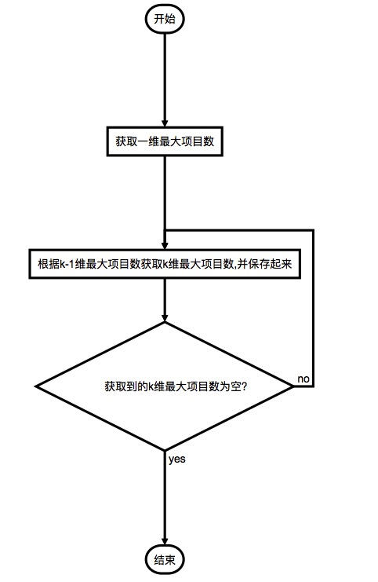

# Apriori算法

### 环境介绍

**请在在Python3以上环境下运行，Python2.X会有中文乱码问题**

### 使用方法

### 先执行

``` sh
python createData.py    // 生成数据
```

再执行：

``` sh
python Apriori.py     // 对生成的数据进行计算
```

### 介绍

- 该[关联规则](https://zh.wikipedia.org/wiki/%E5%85%B3%E8%81%94%E5%BC%8F%E8%A7%84%E5%88%99)在分类上属于单维，单层，布尔关联规则。
- `Apriori` 的核心是基于两阶段频集思想的递推算法
- `Apriori` 是一种最有影响的挖掘布尔关联规则的频繁集项的算法
- 所有支持度[^1]大于最小支持度[^1]项集称为频繁项集（简称`频集`）

### 基本思想

- 简单统计所有含一个元素项目集出现的频数，并找出那些不小于最小支持度的项目集，即`一维最大项目数`
- 循环处理直到再没有最大项目集生成
- 循环过程是：在第`k`步中，根据第`k-1`步生成的`(k-1)`维最大项目集产生`k`维候选项目，然后对数据库进行搜索，得到候选项目集的项集支持度，与最小支持度进行比较，从而得到`k`维最大项目集
- `支持度:` 关联规则 A->B 的支持度 support=P(AB) ，指的是事件 A 和事件 B 同时发生的概率
- `置信度:` confidence=P(B|A)=P(AB)/P(A), 指的是发生事件 A 的基础上发生事件 B 的概率。

### 应用场景

关联规则一个经典的实例是[购物篮分析](http://baike.baidu.com/view/7357329.htm)(Market Basket Analysis)。超市对顾客的购买记录数据库进行关联规则挖掘，可以发现顾客的购买习惯，例如，购买产品X的同时也购买产品Y，于是，超市就可以调整货架的布局，比如将X产品和Y产品放在一起，增进销量。

### 算法特点

- 优点：简单、易理解、数据要求低
  
- 缺点：
  
  ``` 
  - 在每一步产生侯选项目集时循环产生的组合过多，没有排除不应该参与组合的元素;
  - 每次计算项集的支持度时，都对数据库D中的全部记录进行了一遍扫描比较，如果是一个大型的数据库的话，这种扫描比较会大大增加计算机系统的I/O开销。而这种代价是随着数据库的记录的增加呈现出几何级数的增加。
  ```
  
  ​	
  
  ### 流程图
  
  `自己的理解，如果错误，轻喷（逃~`

----




​	

### 算法描述

``` 
I = {I1,I2,I3...Im}是项的集合
D = {t1,t2,t3...tn}是交易数据库
其中每个t是I的真子集
MinSupport是最小支持度
```

​	

``` 
begin
// 找出频繁1项集
P1 = find1Items()
// 循环处理直到没有最大项集产生
for(k = 2; P[k-1] != null;k++) {
	// 根据第k-1维的项目集生成k维项目集
	C[k] = apriori(P[k-1])
	for t in D {
		if t.contains(c[k]) {
			for c in C[k] {
				c.count++
			}
		}		
	}
	// 所有满足最小支持度的项目生成一个新的项集
	P[k] = c > MinSupport for c in C[k]
```

​	

``` 
}
end
```

​	

​	

### 算法实现


[可以看这里](https://github.com/lixin147741/Apriori/blob/master/Apriori.py)

​	

​	

​	